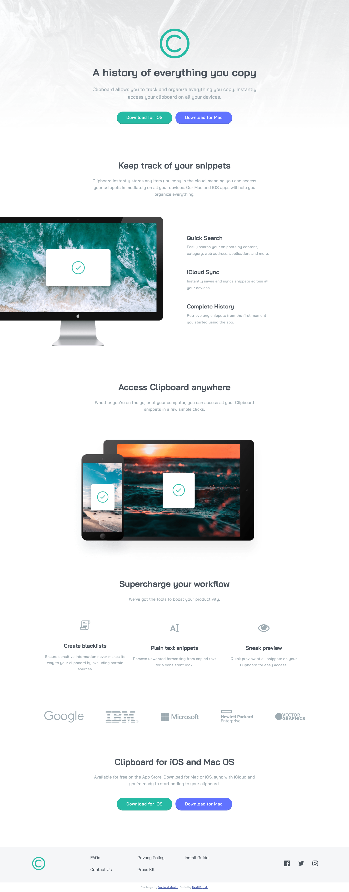

# Frontend Mentor - Clipboard landing page solution

This is a solution to the [Clipboard landing page challenge on Frontend Mentor](https://www.frontendmentor.io/challenges/clipboard-landing-page-5cc9bccd6c4c91111378ecb9). Frontend Mentor challenges help you improve your coding skills by building realistic projects. 

## Table of contents

- [Overview](#overview)
  - [The challenge](#the-challenge)
  - [Screenshot](#screenshot)
  - [Links](#links)
- [My process](#my-process)
  - [Built with](#built-with)
  - [What I learned](#what-i-learned)
  - [Continued development](#continued-development)
  - [Useful resources](#useful-resources)
- [Author](#author)


## Overview

### The challenge

Users should be able to:

- View the optimal layout for the site depending on their device's screen size
- See hover states for all interactive elements on the page

### Screenshot



### Links

- Solution URL: [Add solution URL here](https://your-solution-url.com)
- Live Site URL: [Add live site URL here](https://heidi37.github.io/clipboard-landing-page/)

## My process

### Built with

- Semantic HTML5 markup
- CSS custom properties
- Flexbox
- Mobile-first workflow

### What I learned

I remembered that the best way to preview the media query changes is with the responsive view in the Chrome Dev Tools. When you are in just plain inspect mode sometimes the media queries appear to be firing too soon but they actually are not.

I am getting more comfortable with using nth-of-type and some of the child selectors.

```css
h2:nth-of-type(3n) {
        margin-top: 75px;
    }

.quick-search-col:nth-child(2n) {
        margin-top: 75px;
    }
```

I used flexbox quite a bit on this layout and I am starting to stengthen my muscle memory around it.

```css
   .features-row {
        display: flex;
        justify-content: space-between;
        align-items: center;
        width: 1100px;
        margin: 0 auto;
    }
```

### Continued development

I would recommend doing more work on extra wide device widths.


### Useful resources

- [stack overflow](https://stackoverflow.com/questions/16681054/css-media-query-min-width-not-working-correctly) - This question triggered my memory about how you can't accurately test the media queries by just dragging the screen in inspect mode in Chrome Dev tools, you need to be in responsive mode.


## Author

- Website - [Heidi Fryzell](https://heidifryzell.com)
- Frontend Mentor - [@heidi37](https://www.frontendmentor.io/profile/heidi37)
- Twitter - [@yourusername](https://twitter.com/HeidiFryz)

